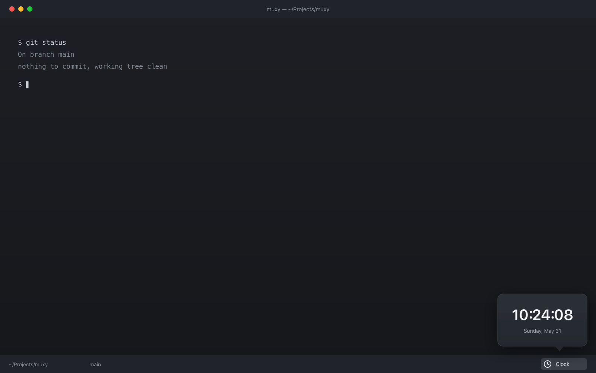

# Clock

A clock for the Muxy status bar. Adds a clock icon to the right side of the
footer status bar; click it to open a small popover showing a live, ticking
clock and the current date. Click outside to dismiss.

## Permissions

- **`panels:write`** — lets the popover size itself to its content
  (`muxy.popover.resize`). No network, no shell, no workspace access.

## How it works

- A `statusBarItem` (right side, clock icon) runs the `open-clock` command.
- That command's `openPopover` action opens the `clock` popover.
- `popovers/clock.html` renders the time in the local timezone, updating once a
  second on the wall-clock boundary. It uses the injected `--muxy-*` theme
  variables (with light/dark fallbacks) and a transparent background so the
  native popover material shows through.

## License

MIT
